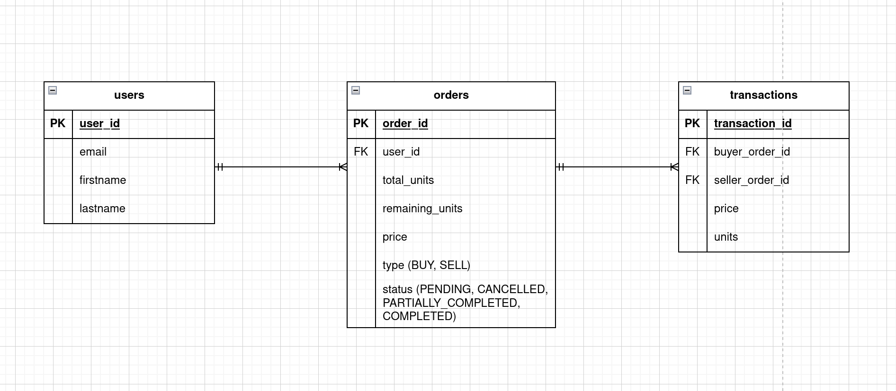
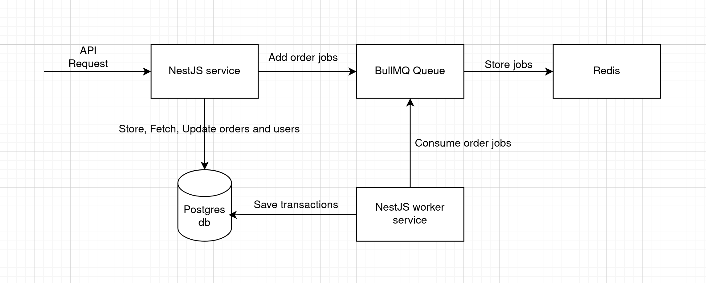

## Description

A simple transaction platform where buyers and sellers can place their orders and a
transaction is automatically created based on their price and available quantity.

### Tools used

- NestJS
- TypeORM
- Postgres
- BullMQ
- Redis

### ERD



### Architecture Diagram



## Project setup

```bash
$ yarn install
```

## Compile and run the project

```bash
# start redis server
$ sudo systemctl start redis-server

# development
$ yarn run start

# watch mode
$ yarn run start:dev

# production mode
$ yarn run start:prod
```
